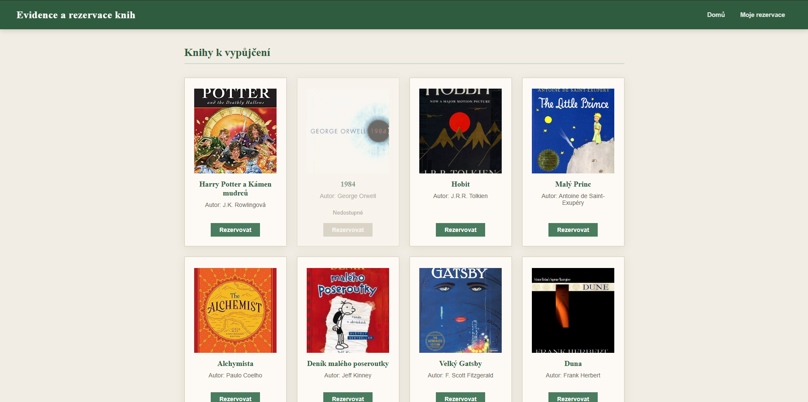
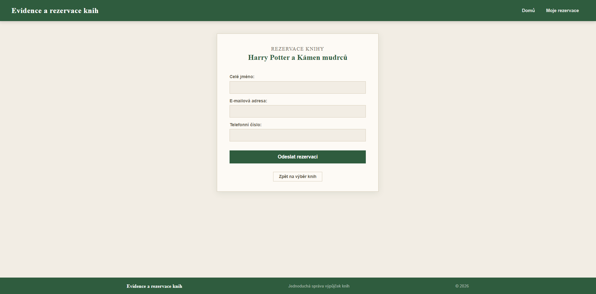
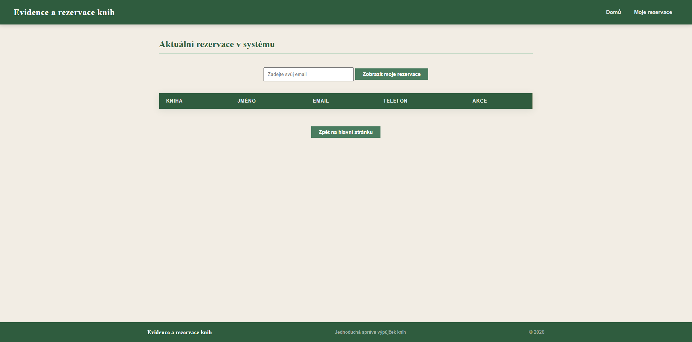
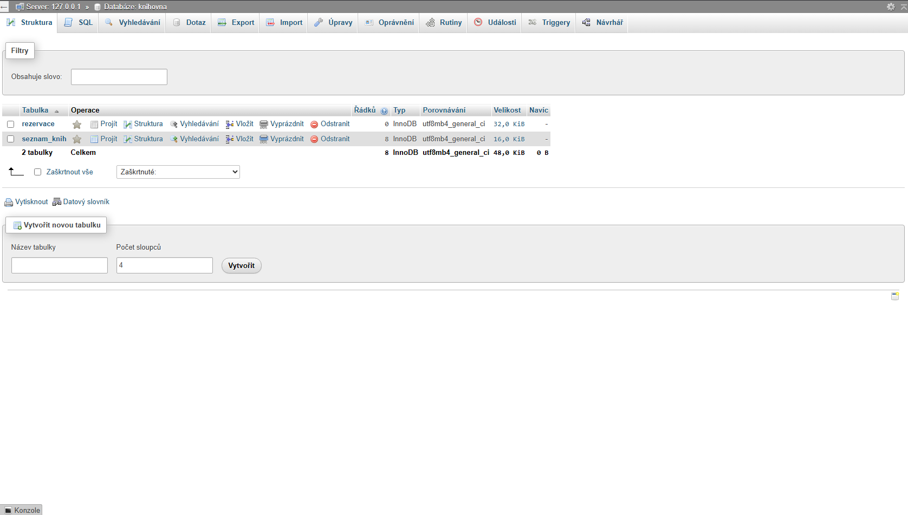

# Evidence a rezervace knih

## 1. Úvod

Tento projekt je jednoduchý webový systém pro rezervaci knih.
Uživatel si může prohlížet knihy, rezervovat je a zobrazit své rezervace pomocí emailu.

Projekt byl vytvořen pomocí:

* PHP
* MySQL
* HTML
* CSS
* JavaScript

---

# 2. Cíl projektu

Cílem bylo vytvořit jednoduchý informační systém pro správu rezervací knih.

Systém umožňuje:

* zobrazovat knihy,
* ukládat rezervace,
* kontrolovat dostupnost knih,
* rušit rezervace.

---

# 3. Struktura projektu

```text id="zgmw42"
knihovna/
│
├── screenshoty/
├── index.php
├── rezervace.php
├── ulozeni-rezervace.php
├── vypis-rezervaci.php
├── smazat-rezervaci.php
├── db.php
├── styles.css
├── script.js
├── knihovna.sql
└── README.md
```

## Popis souborů

* `index.php` – hlavní stránka s knihami
* `rezervace.php` – formulář rezervace
* `ulozeni-rezervace.php` – ukládání rezervací
* `vypis-rezervaci.php` – zobrazení rezervací podle emailu
* `smazat-rezervaci.php` – odstranění rezervace
* `db.php` – připojení k databázi
* `styles.css` – vzhled webu
* `knihovna.sql` – export databáze

---

# 4. Databáze

Projekt používá databázi MySQL.

## Tabulka `seznam_knih`

Obsahuje:

* ID knihy
* název
* autora
* obrázek knihy

## Tabulka `rezervace`

Obsahuje:

* ID rezervace
* jméno
* email
* telefon
* ID rezervované knihy

Tabulky jsou propojené pomocí (`FOREIGN KEY`).

---

# 5. Funkce projektu

## Zobrazení knih

Na hlavní stránce jsou vypsány všechny knihy z databáze.

## Rezervace knih

Uživatel vyplní formulář a rezervace se uloží do databáze.

## Kontrola dostupnosti

Rezervovaná kniha se automaticky označí jako nedostupná.

## Moje rezervace

Po zadání emailu se zobrazí pouze rezervace daného uživatele.

## Zrušení rezervace

Rezervaci lze odstranit tlačítkem „Zrušit“.

---

# 6. Ukázky obrazovek

## Hlavní stránka



## Rezervace knihy



## Moje rezervace



## Databáze



---

# 7. Instalace a spuštění

## Požadavky

* XAMPP
* Apache
* MySQL
* phpMyAdmin

---

## Instalace

### 1. Přesunutí projektu

Projekt vložte do:

```text id="zjlwm1"
C:\xampp\htdocs\
```

Například:

```text id="p9zw3r"
C:\xampp\htdocs\knihovna
```

---

### 2. Spuštění serveru

V XAMPP spusťte:

* Apache
* MySQL

---

### 3. Vytvoření databáze

V phpMyAdmin vytvořte databázi:

```text id="vxj8l0"
knihovna
```

---

### 4. Import databáze

Importujte soubor:

```text id="7d12hu"
knihovna.sql
```

---

### 5. Spuštění projektu

Otevřete v prohlížeči:

```text id="s3q2b6"
http://localhost/knihovna
```

---

# 8. Závěr

Projekt splňuje základní funkce informačního systému pro rezervaci knih.

